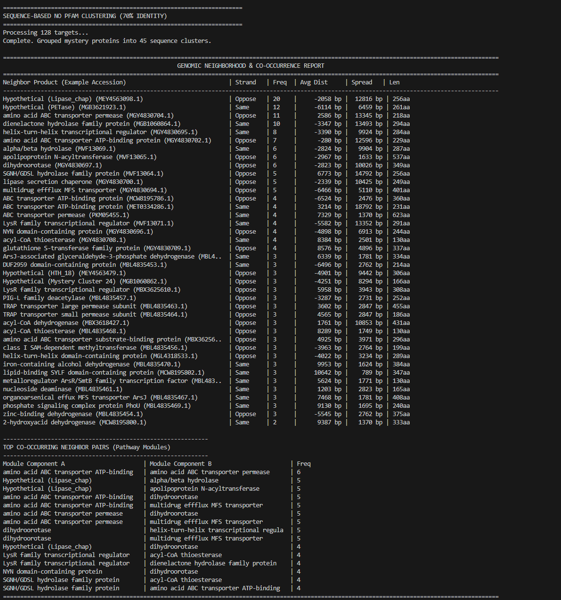

# Enzyme Engine

### A Comparative Genomics Pipeline for Discovering Functional Gene Modules and Exploring Bacterial Protein Diversity

#### By Aidan
---

## Overview
Enzyme Engine is a bioinformatics tool designed to find and map genomic neighborhood networks of prokaryotic protein homologs. It combines BLAST discovery with local synteny analysis and domain identification to reveal conserved genetic modules across phyla.

---

This project was inspired by my experiences (and frustrations) working with poorly characterized biochemcial pathways for metabolic engineering, and by the [Enzyme Function Initiative Tools](https://efi.igb.illinois.edu/). It is my attempt to streamline, optimize, and expand on comparative genomic context searching to find functional proteins for a pathway of interest.

*Furthermore, this project was motivated by a desire to show that there are more ways to observe, characterize, and harness biodiversity than to only indescriminately feed it into LLMs.*

---
## Features

- Takes a FASTA formatted protein sequence, and runs a large BLASTp search to find homologs.
- Uses signed genomic distances to distinguish upstream and downstream neighbors and reveal possible operon orientation.
- Automatically runs `hmmscan` against a Pfam-A database (locally) to annotate domains in hypothetical proteins.
- Calculates and displays frequency, avg distance, spread of avg distances, strand, and avg size of genomic neighbors of homologs (="anchor" proteins).
- Finds and reports top co-occuring genomic neighbors to map pathway modules/operons.

---
### Prerequisites
- Python 3.10
- HMMER3 Installed and accessible in PATH
- NCBI API Key (Highly recommended for 100+ hits)
- Pfam-A Database formatted with `hmmpress`

### Workflow
1. Performs a BLASTp search to identify N homologs of input sequence.
2. Queries NCBI for the genomic location of each homolog and fetches a +-10kb window.
3. Scans every hypothetical neighbor against Pfam and cluster remaining hypothetical proteins by sequence identity.
4. Reports a synteny summary with frequency, avg distance, spread of distances, strand, and avg size of neighbors for easy viewing.
5. Reports a top co-occuring neighbor pair table for given neighbors A and B with frequencies of co-occurrence.

### Example output with input PETase (A0A0K8P6T7.1) plastic degrading enzyme from *Piscinibacter sakaiensis* for 200 BLAST hits:

___
## Future Directions and Features (In development)
- Multiple-linkage analysis to move from anchor-neighbor pairs to detecting 3+ conserved modules.
- Pull existing metabolic pathway data from MetaCyc and search for "missing" proteins also involved for pathway functionality.
- Phylogenetic and biosample analysis to investigate possible phylogenetic and/or environmental correlations with protein sequence.
- Alphafold integration, active site analysis, and possible molecular dynamics simulations to probe for potential functional mutation.

