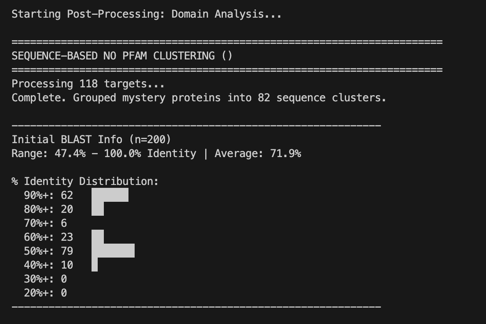
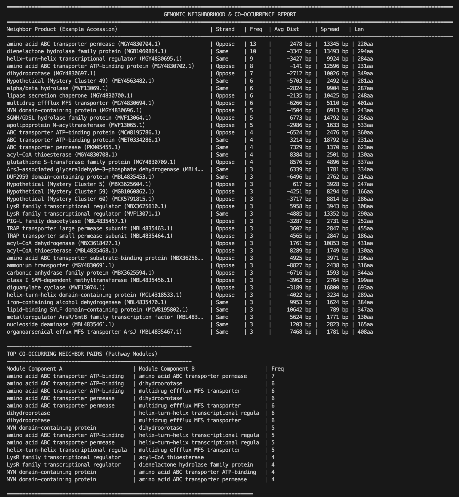
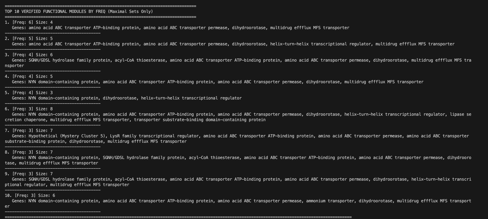

# Enzyme Engine

### A Comparative Genomics Pipeline for Discovering Functional Gene Modules and Exploring Bacterial Protein Diversity

#### **Author: Aidan William Angus-Henry**

---

## Overview

Enzyme Engine is a bioinformatics tool designed to find and map genomic neighborhood networks of prokaryotic protein homologs. It combines BLAST discovery with local synteny analysis and domain identification to reveal conserved genetic modules across phyla. Features in-development include known operon function mapping through integration with MIBiG and MetaCyc databases, followed by a "deep search" consisting of phylogenetic and structural analysis of un-annotated/hypothetial proteins of interest.

---

This project was inspired by the technical limitations and bottlenecks I encountered working with poorly characterized biochemical pathways for metabolic engineering, and by my use of the [Enzyme Function Initiative Tools](https://efi.igb.illinois.edu/). It is an attempt to streamline, optimize, and expand on comparative genomic context searching to discover functional "accessory" proteins for a pathway of interest.

_Furthermore, this project was motivated by a desire to leverage comparative genomic and environmental context to characterize and harness biodiversity, offering a targeted alternative to black-box predictive models trained on insufficient data._

---

## Key Features

- Takes a FASTA formatted protein sequence, and runs a large BLASTp optimized to find homologs (="anchors") and perform a representative search through bacterial biodiversity.
- Uses signed genomic distances to distinguish upstream and downstream neighbors of anchor proteins, and reveal possible operon orientation.
- Automatically runs `hmmscan` against a Pfam-A database (locally) to annotate domains in hypothetical proteins.
- Calculates and displays frequency, avg distance, spread of avg distances, strand, and avg size of genomic neighbors of homologs (="anchor" proteins).
- Finds and reports top co-occurring genomic neighbors and modules for follow-up analysis.

---

### Prerequisites

- Python 3.10
- HMMER3 Installed and accessible in PATH
- NCBI API Key (Highly recommended for 100+ hits)
- Local Pfam-A Database formatted with `hmmpress`

### Workflow

1. Performs a BLASTp search to identify N homologs of input sequence.
2. Queries NCBI for the genomic location of each homolog, and fetches a +-10kb window.
3. Scans every hypothetical neighbor against Pfam and cluster remaining hypothetical proteins by sequence identity.
4. Reports a synteny summary with frequency, avg distance, spread of distances, strand, and avg size of neighbors for easy viewing.
5. Reports a top co-occurring neighbor pair table for given neighbors A and B with frequencies of co-occurrence.
6. Runs and reports a co-occurrence analysis searching for linked modules of multiple members using genomic neighborhood data.

### Example output with input PETase (A0A0K8P6T7.1) plastic degrading enzyme from _Piscinibacter sakaiensis_ for 200 BLAST hits:

**Genomic Neighbors Overview**

- Top genomic neighbors of PETase homologs include other hydrolases, transporters, dihydroorotase, and an efflux pump.
- Spread is a function of the (maximum largest distance away - minimum largest distance away), providing a crude estimate of variation in neighbor genomic distance.

**Co-occurrence analysis**

- Enzyme Engine displays the top 10 functional modules found sorted by frequency with at least 4 members.
- For our 200-hit PETase search, the most frequent module consists of a transporter & permease, dihydroorotase, and efflux pump. Interestingly, dihydroorotase is often found associated with PET degredation pathway machinery. Whether or not dihydroorotase is associated with PET degredation remains unknown.

---

## Future Directions and Features (In development)

- Expanding multiple-linkage analysis to probe larger genomic windows than the current +-10kb.
- Pull existing metabolic pathway data from MetaCyc and assign putative operon members to precise biochemical reactions to find mystery proteins that seem to be linked with a given gene cluster.
- For a given hypothetical/un-annotated protein, trigger a "deep search" that integrates phylogenetic, biosample, and structural analysis to investigate functional role of linked protein.
- Alphafold integration, active site analysis, and possible molecular dynamics simulations to probe for functional mutations or sufficient deviation from predicted function.
