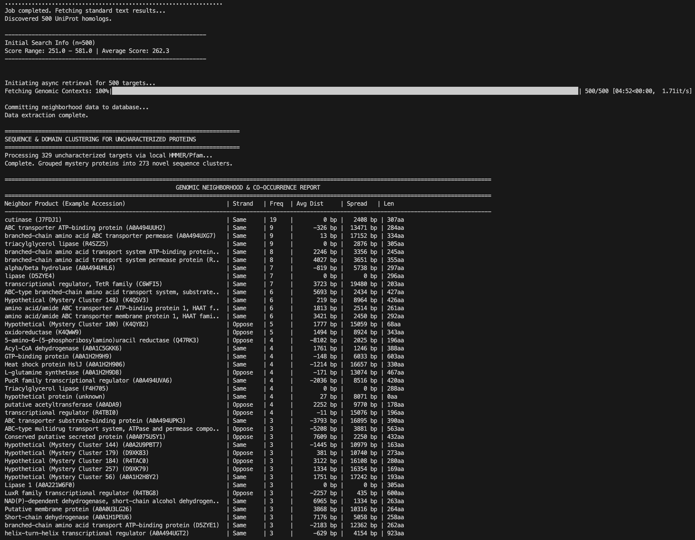
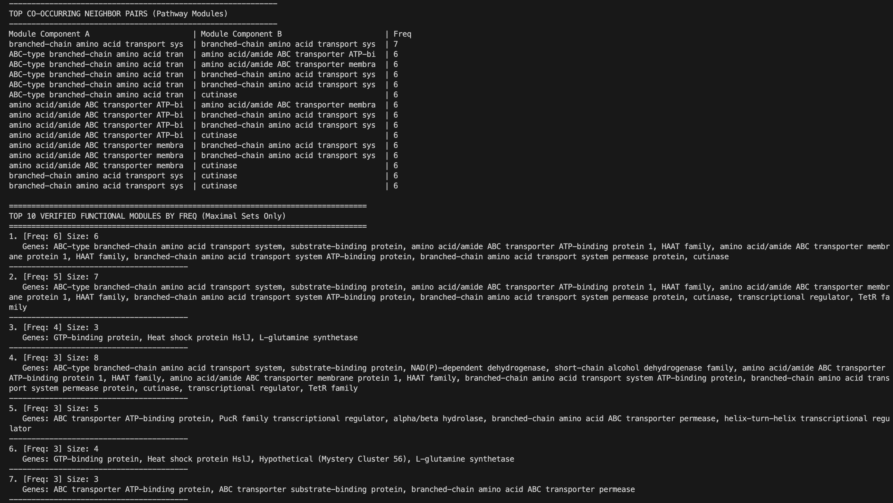

# Enzyme Engine

### A Comparative Genomics Pipeline for Discovering Functional Gene Modules and Exploring Bacterial Protein Diversity

#### **Author: Aidan William Angus-Henry**

---

## Overview

Enzyme Engine is a bioinformatics tool designed to find and map genomic neighborhood networks of prokaryotic protein homologs. It combines BLAST discovery with local synteny analysis and domain identification to reveal conserved genetic modules across phyla. Features in-development include known operon function mapping through integration with MIBiG and MetaCyc databases, followed by a "deep search" consisting of phylogenetic and structural analysis of un-annotated/hypothetical proteins of interest.

### Motivation

This project was inspired by the technical limitations and bottlenecks I encountered working with poorly characterized biochemical pathways for metabolic engineering, and by my use of the [Enzyme Function Initiative Tools](https://efi.igb.illinois.edu/). It is an attempt to streamline, optimize, and expand on comparative genomic context searching to discover functional "accessory" proteins for a pathway of interest.

_Furthermore, this project was motivated by a desire to leverage comparative genomic and environmental context to characterize and harness biodiversity, offering a targeted alternative to black-box predictive models trained on insufficient data._

---

## Key Features

- **UniProtKB Homology Search**: Takes a FASTA formatted protein sequence and submits a BLASTp job via the EBI REST API against UniProtKB to find representative homologs (="anchors").
- **Asynchronous Data Retrieval**: Utilizes `aiohttp` and `asyncio` to concurrently fetch rich metadata from UniProt and EMBL flat files from the ENA, bypassing legacy API bottlenecks.
- **Synteny & Orientation Mapping**: Uses signed genomic distances from EMBL feature tables to distinguish upstream and downstream neighbors of anchor proteins and map operon orientation.
- **Local Domain Annotation**: Automatically runs `hmmscan` against a local Pfam-A database to annotate domains in uncharacterized or hypothetical proteins, clustering sequences that lack known domains by identity.
- **Module Discovery**: Calculates maximal functional modules and top co-occurring genomic neighbor pairs using frequent itemset mining, outputting frequency, average distance, and strand orientation.

---

## Getting Started

### Prerequisites

- Python 3.10
- HMMER3 Installed and accessible in PATH
- Local Pfam-A Database formatted with `hmmpress`

### Installation

1. Clone the repository and enter the directory:
   `git clone [https://github.com/aangush/enzyme_engine.git](https://github.com/aangush/enzyme_engine.git)
cd enzyme_engine`

2. Create and activate the Conda environment:
   `conda env create -f environment.yml 
conda activate enzyme_env`

3. Prepare the pfam database: Download the `Pfam-A.hmm` database, format it using `hmmpress Pfam-A.hmm`, and place all resulting files into a data/pfam directory within the project root.

### Quick Start:

To run the pipeline, provide a FASTA file containing your target anchor protein sequence. Execute the main script from the root directory:
`python src/GNN_analysis/main.py path/to/input.fasta`

---

### Workflow

1. Submits a BLASTp search to EBI to identify homologous targets within UniProtKB.

2. Asynchronously queries UniProt for EMBL cross-references and fetches the corresponding +-10kb genomic window from the ENA.

3. Commits sequence, positional, and functional metadata of all extracted neighbors into a local SQLite database (data/GNN.db).

4. Scans every uncharacterized/hypothetical neighbor against Pfam and clusters remaining unknown proteins by sequence identity.

5. Generates a synteny summary and computes co-occurrence networks to report verified functional modules with high statistical support.

### Example output with input PETase (A0A0K8P6T7.1) plastic degrading enzyme from _Piscinibacter sakaiensis_ for 500 BLAST hits:

**Genomic Neighbors Overview**

- Top genomic neighbors of PETase homologs include other PET-related hydrolases, transporters, and possible downstream catabolic enzymes like Acyl-CoA dehydrogenase.
- Spread is a function of the (maximum largest distance away - minimum largest distance away), providing a crude estimate of variation of neighbor genomic distance to anchor.

**Co-occurrence analysis**

- Enzyme Engine displays the top 10 functional modules found sorted by frequency with at least 4 members, providing insights about functional linkage.
- For our 500-hit PETase search, the most frequent module contains a cutinase (PETases are derived from this family), alongside a complete ABC-type branched chain amino acid transport system, which could play a role in the transport of plastic degradation byproducts.

---

### Known Limitations & Technical Notes

The pipeline recently moved from a synchronous NCBI Entrez setup to an asynchronous UniProt/ENA architecture. This change was made to resolve frequent API timeouts and issues with highly fragmented GenBank queries.

Currently, the UniProt/ENA pipeline yields fewer genomic neighbors than the previous version. This is because the new script maps each discovered protein to only a single primary genomic contig. The previous NCBI IPG approach mapped a single protein sequence to every known sequenced genome it appeared in, multiplying the results. A fix is actively in development to loop through all available ENA coordinates for every UniProt hit, which will restore the pipeline's full statistical power.

---

## Future Directions and Features (In development)

- Expanding multiple-linkage analysis to probe larger genomic windows than the current +-10kb, or probe +- X CDSs, to normalize for genomic distance spread.

- Pulling existing metabolic pathway data from MetaCyc and assigning putative operon members to precise biochemical reactions to find unknown proteins linked with a given gene cluster.

- For a given hypothetical/un-annotated protein, triggering a "deep search" that integrates phylogenetic, biosample, and structural analysis to investigate the functional role of the linked protein.

- Alphafold integration, active site analysis, and possible molecular dynamics simulations to probe for functional mutations or sufficient deviation from predicted function.
